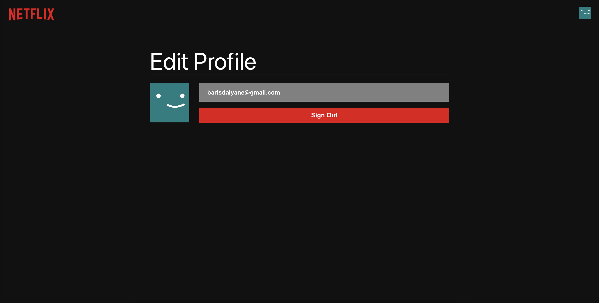

# Netflix Clone 🎬

## Built With 🔨

- React.js
- Redux
- Firebase Authentication
- The Movie Database (TMDB) API

## How to use

- Clone the repository and fill in the relevant places in the `.env` file.

```
REACT_APP_TMDB_API_KEY=
REACT_APP_FIREBASE_KEY=
REACT_APP_AUTH_DOMAIN=
REACT_APP_PROJECT_ID=
REACT_APP_STORAGE_BUCKET=
REACT_APP_MESSAGING_SENDER_ID=
REACT_APP_APP_ID=
```

- Run the following command:

```
npm start
```

## Screenshots


<hr>


<hr>


<hr>



## Learn More

You can learn more in the [Create React App documentation](https://facebook.github.io/create-react-app/docs/getting-started).

To learn React, check out the [React documentation](https://reactjs.org/).

## License

This project is released under the MIT License.